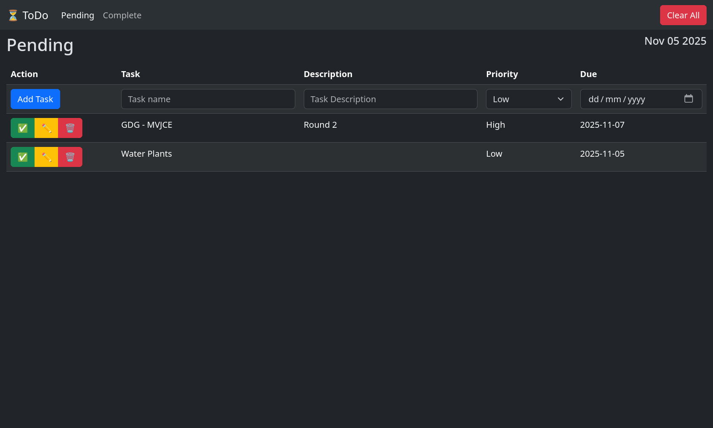
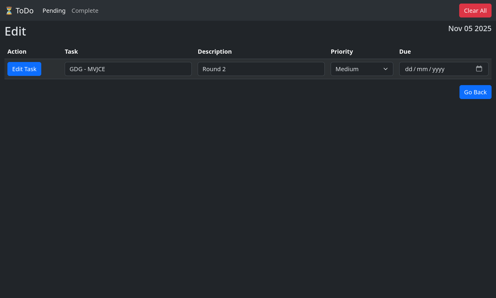
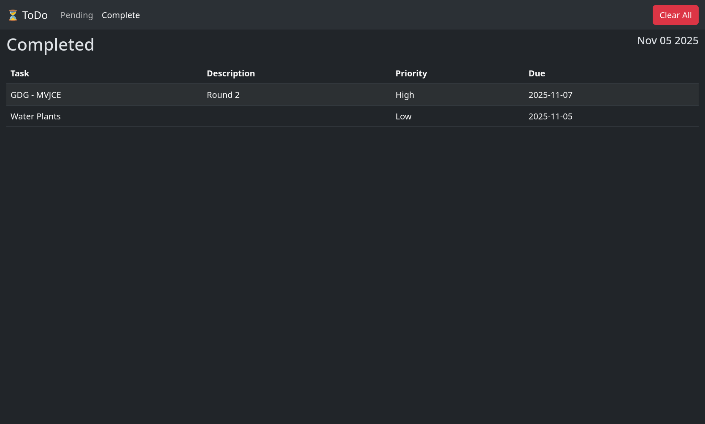

# ToDo App

A simple and efficient Todo application built with Flask and SQLAlchemy. This web application helps you manage your tasks by providing features to create, track, and organize your todos.

## Features

- Create new tasks with details, priority, and due dates
- View pending and completed tasks separately
- Mark tasks as complete
- Edit existing tasks
- Clear all tasks by status (pending/complete)
- Responsive web interface

## Tech Stack

- **Backend**: Flask (Python web framework)
- **Database**: SQLAlchemy (SQL database ORM)
- **Frontend**: HTML, CSS (templates using Jinja2)

## Installation

1. Clone the repository:
```bash
git clone https://github.com/prajingn/ToDo-App.git
cd ToDo-App
```

2. Create and activate a virtual environment (recommended):
```bash
python -m venv venv
source venv/bin/activate
```

3. Install the required dependencies:
```bash
pip install -r requirements.txt
```

## Usage

1. Start the application:
```bash
python app.py
```

2. Open your web browser and navigate to `http://localhost:5000`

3. You can now:
   - Add new tasks with details and due dates
   - View your pending tasks at the home page
   - View completed tasks in the complete section
   - Edit or mark tasks as complete as needed

## Project Structure

```
ToDo-App/
├── app.py              # Application entry point
├── requirements.txt    # Project dependencies
└── todo/              # Main application package
    ├── __init__.py    # Package initialization
    ├── routes.py      # Route definitions
    ├── static/        # Static files (CSS, JS)
    └── templates/     # HTML templates
        ├── base.html
        ├── complete.html
        ├── edit_task.html
        └── pending.html
```

## Project Showcase
### Pending page:


### Edit page:


### Complete page:

